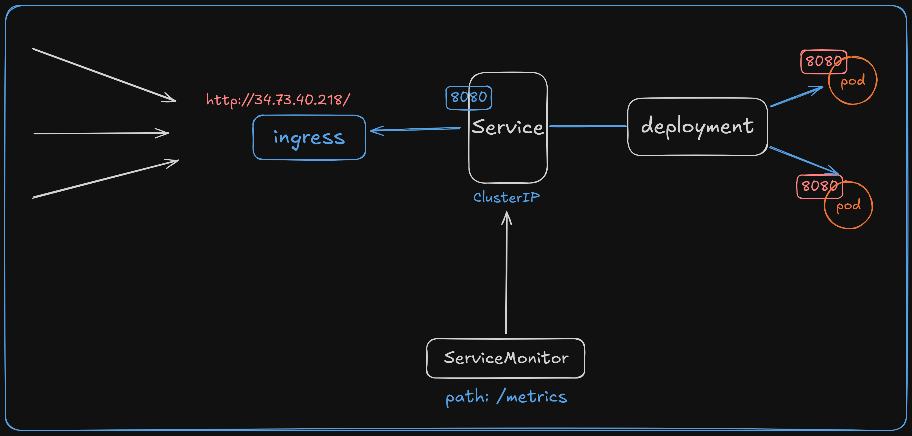

# WebSocket Server with Load Testing

## Overview

This project implements a WebSocket server with comprehensive DevOps practices including containerization, Kubernetes deployment, auto-scaling, observability, and load testing. The server provides real-time messaging capabilities with Prometheus metrics and is designed to handle high-load scenarios with graceful scaling.

## K8S deployments


## Prerequisites

- nvm (for nodejs)
- Docker
- Kubernetes cluster (minikube - preferrable, kind, or cloud provider)
- kubectl
- k6 (for load testing)
- Helm (optional, for monitoring stack)

## Quick Start

### 1. Local Development

```bash
# Install dependencies
cd server
npm install

# Start the server
node index.js
```

The server will be available at `ws://localhost:8080`

### 2. Run Load Test

```bash
# Install k6
# macOS: brew install k6
# Linux and Other platforms: https://grafana.com/docs/k6/latest/set-up/install-k6/

# Run load test
k6 run loadtest/websocket-test.js
```

